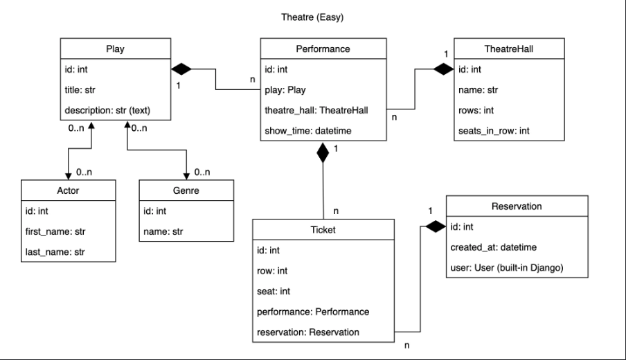

# Theater API 🎭🌍

This is a DRF project for managing various components of a theater, including performances, shows, tickets, and users. The API supports authentication and user management and provides detailed documentation via Redoc and Swagger.

## Project Structure 📊


## Features ✨

- **API Endpoints** for managing:
  - Performances
  - Shows and Screenings
  - Tickets
  - Users
- **User Authentication**:
  - User registration
  - JWT authentication
- **API Documentation** - Redoc and Swagger
- **Database Management** - PostgreSQL
- **Containerized Deployment** - Docker and Docker Compose

## Technologies Used ⚙️

- **Backend**: Python 3.12, Django 5.1.4, Django REST Framework
- **Database**: PostgreSQL
- **Authentication**: Simple JWT
- **Containerization**: Docker, Docker Compose
- **Environment Management**: Poetry, Python-dotenv

---

## Getting Started 🐾

### Prerequisites

- Python 3.12+
- Poetry
- Docker and Docker Compose
- Make

### Local Setup

#### 1. Clone the Repository
```bash
git clone https://github.com/molodsh1y1/theatre-api
cd theater-api
```

#### 2. Create a .env File
Fill in the `.env` file, use `.env.template` as a reference to that.

#### 3. Install Dependencies
Run the following command to install dependencies using Poetry:
```bash
poetry install
```

#### 4. Apply Migrations
Run database migrations:
```bash
make migrate
```

#### 5. Start the Development Server
Start the Django development server:
```bash
make runserver
```

The server will be available at [http://127.0.0.1:8000](http://127.0.0.1:8000).

---

### Running with Docker

#### 1. Build and Start the Services
Use Docker Compose to build and run the application and database:
```bash
docker-compose up --build
```

#### 2. Access the API
- The API will be available at [http://127.0.0.1:8000](http://127.0.0.1:8000).
- The PostgreSQL database will be available on port 5432.

---

## Documentation 📄

API documentation is available via Redoc at:
http://127.0.0.1:8000/redoc/

and via Swagger at:
http://127.0.0.1:8000/api/doc/swagger/

---
